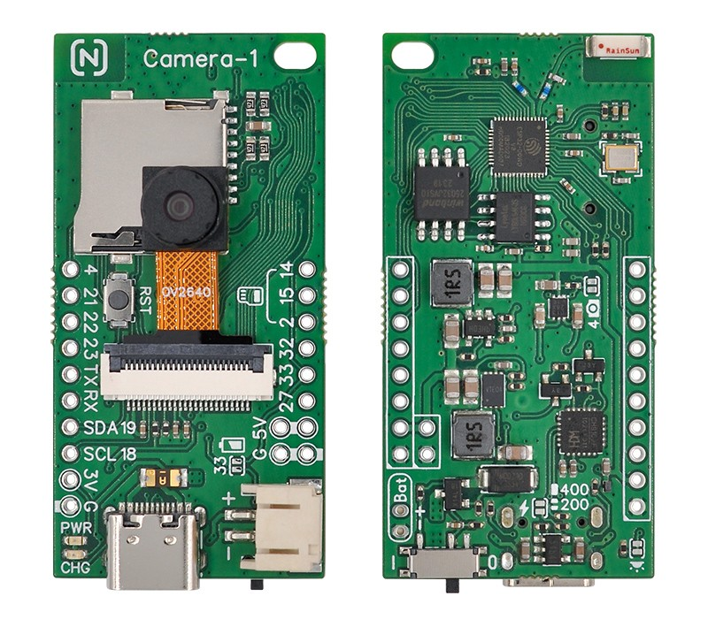

## Node-Matrix Camera-1

### Description
Camera-1 is a camera module based on the ESP32 chip, featuring 4MB of Flash and 8MB of PSRAM. It uses an OV2640 image sensor capable of capturing images at up to 1600×1200 resolution and supports real-time video streaming over Wi-Fi.

The module is optimized for scalability. Breakout ports include 10 GPIOs, along with UART and I2C interfaces. An onboard DC-DC converter provides 5V and 3.3V power outputs, each capable of delivering up to 500mA. Additional features include a built-in USB-to-serial interface, an SD card slot, and battery charging management. By shorting the designated solder jumper pads, you can enable battery voltage detection and camera power control.
